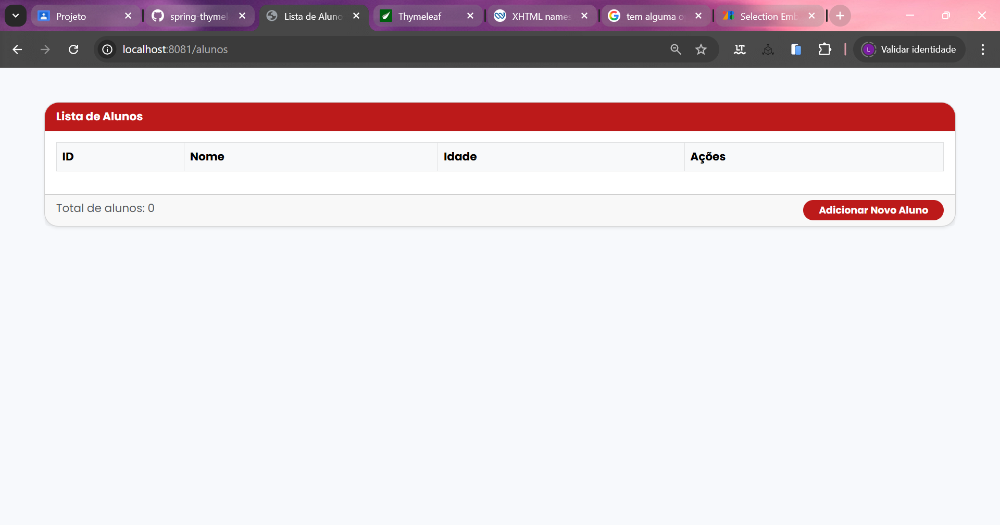
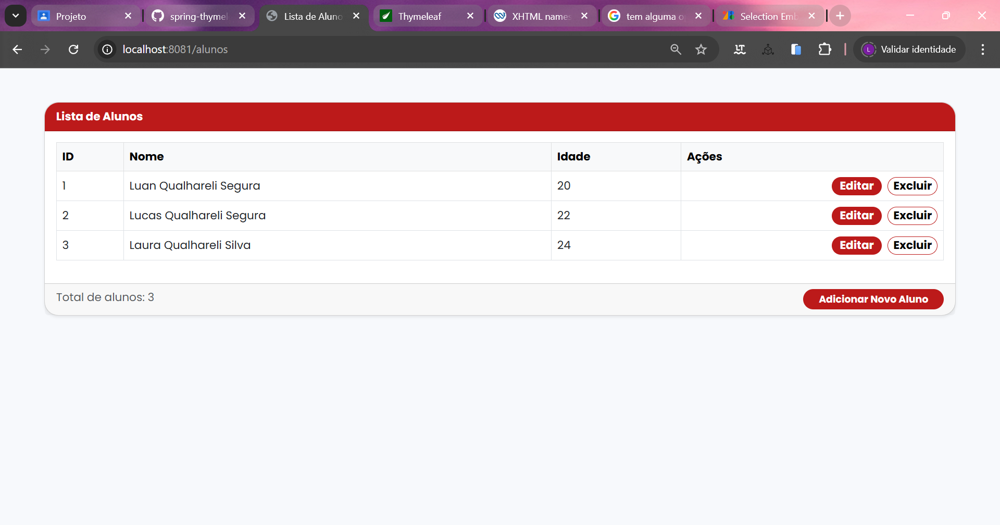
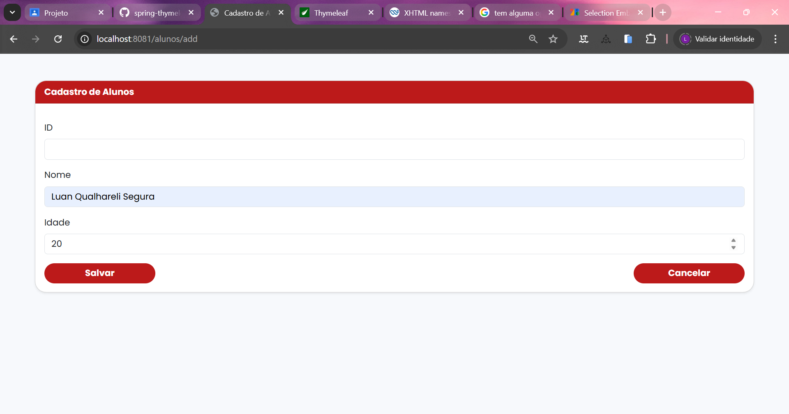
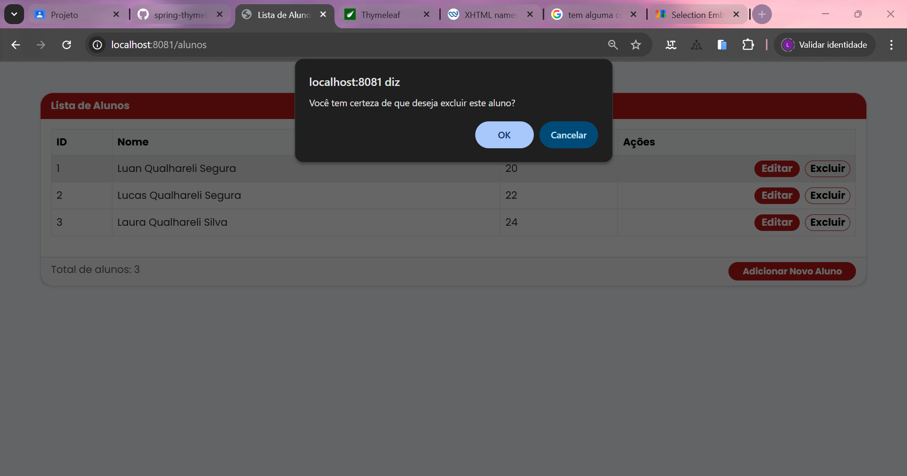
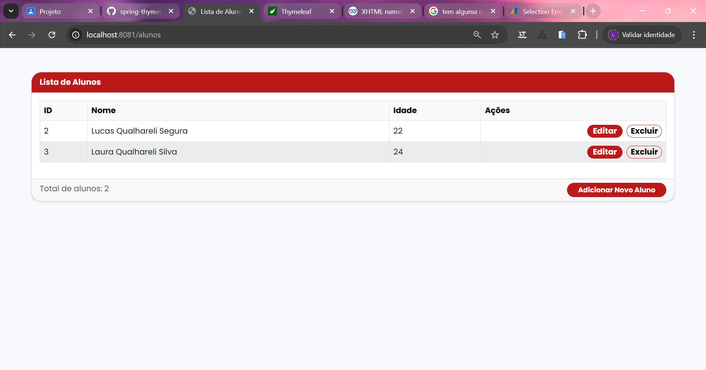

# 🏫 Sistema de Cadastro de Alunos (CRUD) com Spring Boot e Thymeleaf

## 🎯 Descrição do Projeto

Este projeto é uma aplicação web completa desenvolvida com **Spring Boot** que implementa um **CRUD (Create, Read, Update, Delete)** para a gestão de registros de alunos.

O projeto segue todas as **orientações** feitas pelo Professor André::

* **Backend:** Spring Boot 3+ (Java)
* **Acesso a Dados:** Spring Data JPA
* **Banco de Dados:** H2 Database (em memória, configurado no `application.properties`)
* **Frontend (Views):** Thymeleaf
* **Estilização:** Bootstrap 5 e CSS Customizado, garantindo um layout responsivo e organizado.

### Funcionalidades implementadas:
* **Listar:** Exibe todos os alunos cadastrados.
* **Cadastrar:** Permite a inserção de novos alunos com validação de dados.
* **Editar:** Permite a atualização das informações de um aluno existente.
* **Excluir:** Remove um registro do banco de dados.

## ▶ Passos para Executar a Aplicação

### 1. Clonar o Repositório

https://github.com/LuanQS2/Projeto-Des_Internet.git

### 2. Abrir alguma IDE (OBS: RECOMENDO QUE ABRA NO INTELLIJ IDEA)

### 3. Procure o projeto clonado em seu dispositivo e o abra

### 4. Localize a classe principal ApiEscolaApplication.java

### 5. Execute o método a classe principal (Neste botão "▶️")

### 6. Acessar a aplicação (URL PRINCIPAL)

http://localhost:8081/alunos

### OBS: CASO QUEIRA ACESSAR O BANCO DE DADOS 

http://localhost:8081/h2-console

Use as credenciais do application.properties para conectar:

🏦 JDBC URL: jdbc:h2:mem:db_escola
👨‍💻 User Name: sa
🔑 Password: password

## 📸 Prints das Telas Principais

### 1. Listagem de Alunos vazia (`/alunos`)

### 2. Listagem de Alunos

### 3. Formulário de Cadastro/Edição

### 4. Exclusão de Registro

### 5. Aluno removido

